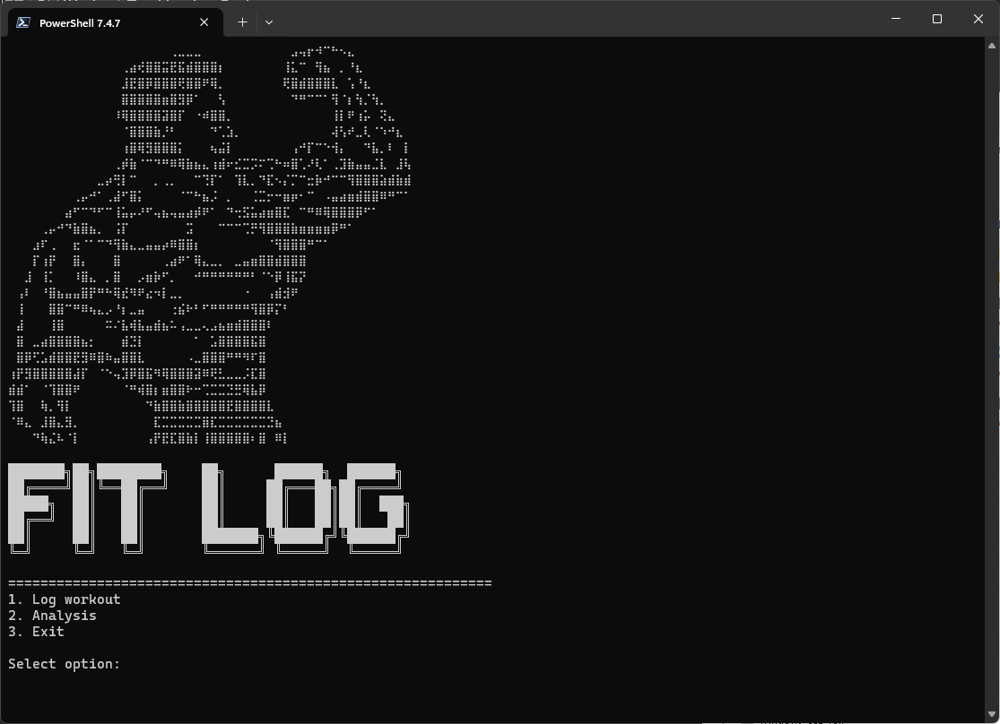

# FitLog

CLI workout tracker for people who prefer pen and paper in the gym but want data analysis later.

## Usage

```bash
python fitlog.py
```

## Important Notes

Exercise names must be consistent for proper analysis. The app treats "barbell curls", "bb curls", and "bb curl" as three different exercises. Use the same naming convention each time you log an exercise.

## Features

- Main navigation menu
- Basic workout logging flow
- Exercise and set tracking
- SQLite data storage
- Weight/reps input parsing
- Auto unit detection (lbs/kg)

## Planned Features

- Workout analysis and stats
- Progress tracking charts
- Exercise history lookup

## Requirements

- Python 3.6+
- No external dependencies

## Screenshots

### Main Menu


### Log Workout


### Analysis


### Database Tables


### Workouts Table


### Exercises Table


### Sets Table
# FitLog

CLI workout tracker for people who prefer pen and paper in the gym but want data analysis later.

## Usage

```bash
python fitlog.py
```

## Important Notes

Exercise names must be consistent for proper analysis. The app treats "barbell curls", "bb curls", and "bb curl" as three different exercises. Use the same naming convention each time you log an exercise.

## Features

- Main navigation menu
- Basic workout logging flow
- Exercise and set tracking
- SQLite data storage
- Weight/reps input parsing
- Auto unit detection (lbs/kg)

## Planned Features

- Workout analysis and stats
- Progress tracking charts
- Exercise history lookup

## Requirements

- Python 3.6+
- No external dependencies

## Screenshots

### Main Menu


### Log Workout


### Analysis


### Database Tables


### Workouts Table


### Exercises Table


### Sets Table
